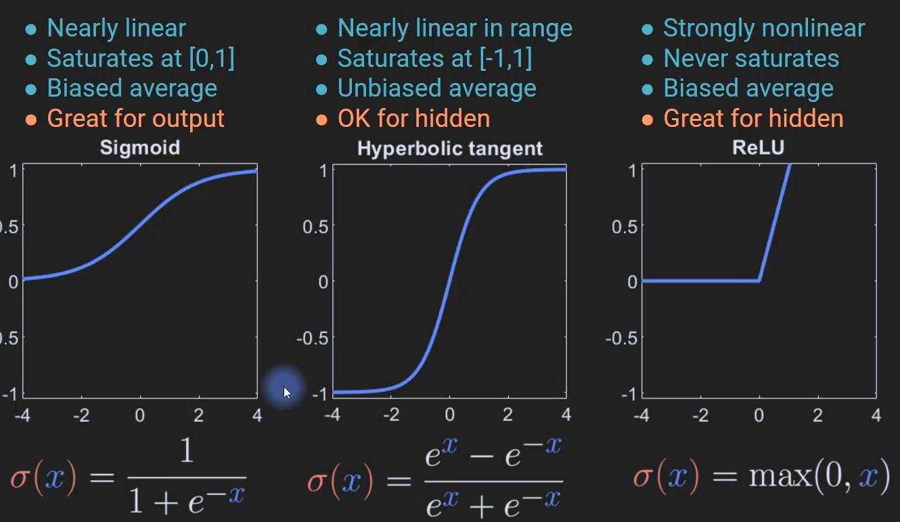

# 활성화 함수 

비선형 함수를 추가할 때

- 은닉층에선
  - 비선형성을 줄 때
  - 계산을 간단하게 할 때
  - 범위를 제한 할 때
  - 그라디언트 소실과 발산을 방지해야 할 때
- 출력층에선
  - classification, regression 할 때
  - 분류를 할 때는 경계를 확실히 해야할 대

### 어떤 걸 사용해야 좋을까?
- 일단 흔한 것들은 그만큼 좋다는 거니까 그냥 사용해도 좋아
- 그러나 성능이 좋지않다면 여러가지 시도해보는 것도 좋아.
- 다만 학습할 때만 배교해보고, test 셋에서는 비교하지 마 (무슨 말일까? 검증할 때까지만, meta parameter 튜닝하라는 건가?)