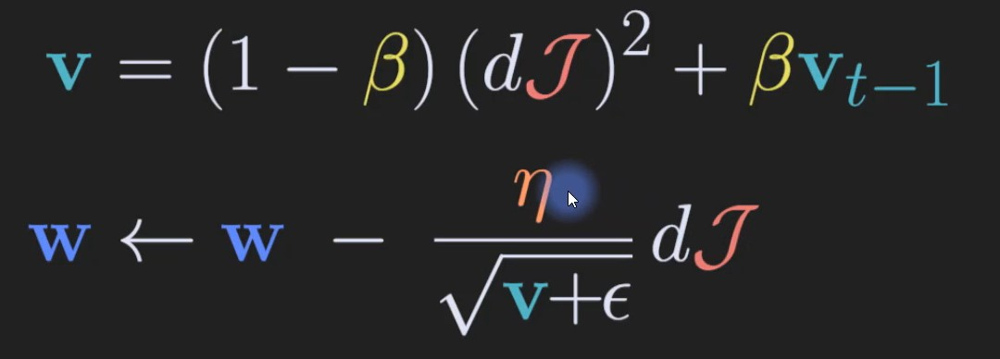
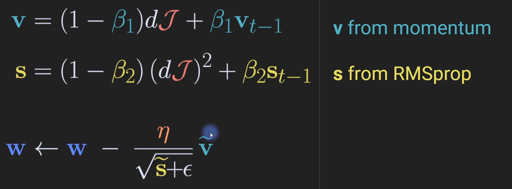
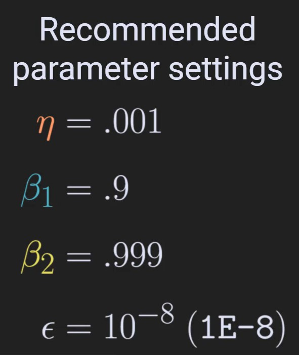
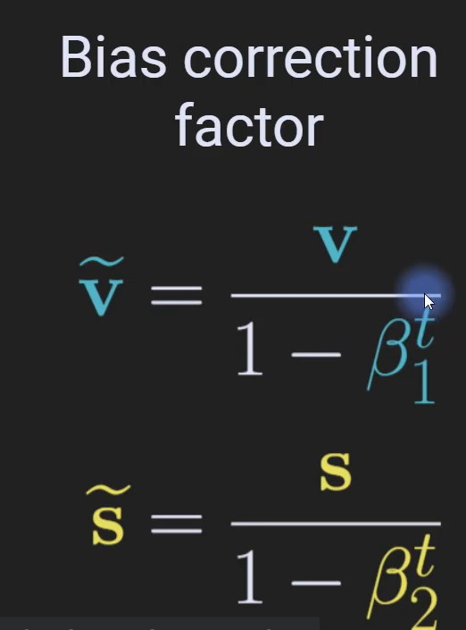

딥러닝은 경사하강이라는 간단한 알고리즘으로 예측과 결과의 차이를 최소를 만드는 과정이야.

하지만 데이터가 많아지면 경사를 계산하고, 하강시키는 연산이 과부하가 될 수 있어.

옵티마이저는 그 경사하강법을 최적으로 가중치를 구하는 방법이야.

## 종류

### SGD

- 각각 샘플을 학습할 때마다 가중치를 변경
- 샘플들이 서로 비슷할 때 매우 효과가 좋아
- 다만 너무 예민해서, 대표성이 적은 샘플에선 변동성이 클 수 있어.

### Mini-batch SGD :

- SGD가 변동성이 너무 커서, N개의 샘플의 손실 평균으로 가중치를 업데이트하는 방식
- 다만 특징 샘플이 서로 비슷한 경우, SGD가 훨씬 빠르고 효과적이긴 해.

### Momentum (SGD-Momentum)

- 가중치 평균화로 부드럽게 만드는 방식
- 각 가중치는 이전 데이터와 해당 데이터의 가중치가 결합된 값
- 
- 

### RMSprop

- root-mean-square propagation
- rms는 표준편차와 구조가 매우 비슷해.
- 
- 움직이는 정도(step size)가 기울기의 크기의 history에 따라 달라져
    - 큰 기울기 -> 작은 움직임
    - 작은 기울기 -> 큰 움직임
- gradient에 움직인 각 방향의 편미분값이 포괄적으로 계산되고 있어서, 각 가중치마다 학습률을 바꿔줘.
- 초기 학습률의 영향이 매우 줄어들고, 자동적으로 학습률을 보간해줘.

### Adam (Adaptive momentum)

 |  | 
---|---| ---|

현재 최고의 옵티마이저로 평가되고 있고, 가장 많이 쓰여.