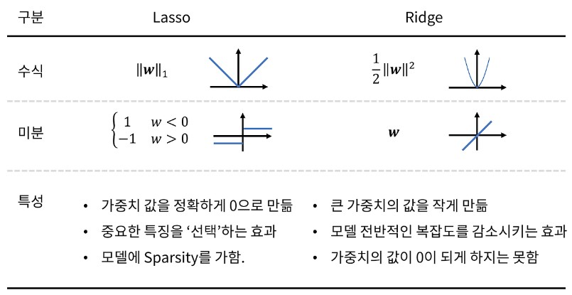

# overfitting

과적합이란, 너무 많은 파라미터 학습으로, 일반화되어 새로운 데이터셋에선 예측이 맞지 않는 상태를 일컬음. 

** 추가로 underfitting은 학습이 부족해서, train, validataion 데이터셋에서 모두 학습이 잘 되지 않는 상태

### 어떻게 확인 할 수 있을까?

- 차원이 1,2 차원으로 작으면, 데이터를 시각화해서 찾을 수 있겠지
- 3차원 이상의 경우는 통계적으로 cross-validation을 통해서 평가를 할 수 있어.

## 어떻게 피할 수 있을까?
### Using cross-validataion(training/hold-out/test sets)

예를들어 80% 데이터로만 학습, 10%는 개발셋, 10%는 테스트셋으로 구분해.

그리고 학습 데이터로만 학습하고 개발셋으로 overfitting을 하고있는지 확인해. 
비교된 내용에 맞춰 가중치를 적용해.

최종적으로 테스트셋으로 예측값을 비교하여 정확도를 도출

#### 어떤 비율로 나눠야 효과적일까?

데이터셋에 따라 다르겠지? 

그래도 충분한 검증 데이터가 필요하기에, 데이터셋이 작으면 검증 비율을 높이고, 
데이터 셋이 크면 검증을 상대적으로 줄여도 괜찮겠지.

비율에 대한 실험은 lec 65에서 진행하였어.

일단 아쉽게도 실험에선 데이터 셋이 너무 작아서 상관관계는 파악하지 못했어.

#### k-fold cross-validataion
K개의 학습검정셋을 만들어 cross validation을 하는 것

#### Generalization

일반화는 모델이 새로운 데이터에 잘 적용되도록 하는 것을 의미해

대신 경계가 있어. 모든 데이터에 적용되는 모델을 만들 필요는 없습니다. 
그래서 적당한 경계 내의 새로운 데이터만 적용되도록 하면 되겠지요.

예를들어 사람에 대한 의학 데이터를 다룬다면,

적어도 사람이라는 범주 내에 있어야 겠고, 
해당 연구 주제에 맞춰, 변동성이 너무 큰, 갓난아기나 초고령인원은 제외할 수도 있지

또한 일반화를 하면 정확도가 떨어져 

그래서 일반화 경계를 신중하게 결정해야해

### Use regulariztion (L2, drop-out, data manipulations, early stoppping)

정규화는 모델이 학습이 아닌 암기를 방지하는 활동이야. 모델을 좀 부드럽게? 선형적인걸 다차항으로 만드는 것처럼 하는 방식

모델의 일반화를 도울 수 있지.

학습 밀도를 줄이기도 하고, 분포를 마꾸기도 해.

그래서 학습시간이 바껴.

학습 정확도는 낮아질 수 있지만, 테스트 정확도는 높아질거야.

다층 구조 모델이나, 큰 모델에서 훨씬 효과적이야.

당연히 충분한 데이터가 있을 때 더 잘 적용되고.

사실 데이터가 적고 간단한 모델에서는 일반화와 같이 별로 좋지 않을 수 있어. 

#### 일반적인 정규화 방식
- lec 71. dropout (Node regularization)
    - 학습 중 무작위로 노드를 제거하는 방식
    - epoch 마다 사용하지 않는 노드들이 바껴
    - 추가로 평가할 때는 dropout이 이루어 지지 않도록 해.
      - 이럴 경우 문제가 노드의 수가 차이나니까 가중치의 합산이 달라지게 돼.
      - 방지하는 방법으로는 평가할 때 노드에 (1-p(drop rate))를 곱해줄 수 있어.
      - 아니면 반대로 학습할 때 1/(1-p) 를 곱해줘서 무게를 늘리는 방법도 있어.
    - 특징
      - 데이터가 줄어서 학습 속도가 빨라져
      - 테스트 정확도는 줄지만, 평가 정확도는 올라
    - 데이터의 수가 줄어드므로 데이터가 많은 경우에 유리하고, 그렇지 않을 경우 데이터를 늘리거나 학습량을 늘려야해
- lec 74. L1, L2 regularization (Loss regularization)
    - 비용 함수를 계산할 때 수학적인 무언가를 추가하는 방식
    - 가중치의 중요도가 너무 커지는 걸 방지하는 거지
    - L1 (lasso) : J += lambda(가중치 벡터 노름)
      - 특정 가중치를 0으로 만들어 중요한 가중치만 남기는 feature selection
      - 인코딩 특징들의 중요도를 이해해야할 때, 즉, 딥러닝보단 일반적인 회귀문제에서 사용
        - 학습정확도가 검증정확도보다 훨씬 높을 때 사용
    - L2 ( ridge, weight decay) : J += lambda(가중치 벡터 노름 제곱 == wTw)
      - 모든 무게를 줄이되 가중치가 클 수록 더 줄어들어
    - lambda = alpha / 2m

      - [참조 블로그](https://seongyun-dev.tistory.com/52)
- batch training, data augmentation (Data regularizatioin)
  - 데이터를 수정해서 더 큰 데이터 셋을 얻는 거야. (image generation 같은 거)
- 어떤 방법이 최선인지는 경험적으로 알아봐야해. 경험적 논문을 보던지 개선해나가는 거지.

#### 토글링

정규화를 적용하기 위해 학습모드와 평가모드를 바꿀 필요가 있어. 

[토글링 문서](About%20toggling.md)
