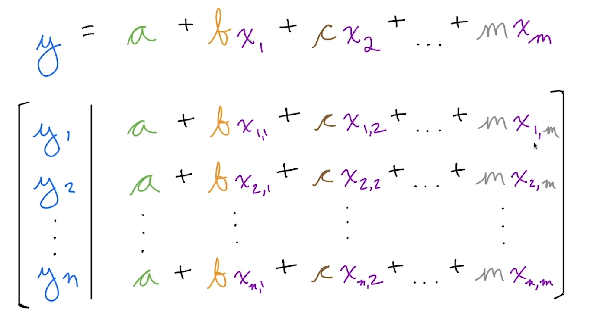

## 선형대수학이란?

선형 구조로 된 미지수가 있는 수학

즉 지수형태가 아니라 1차 식으로 되어 있다는 거지

**연립 1차 방적식으로 미지수를 푸는 수학**

### 대수학이란?

미지수가 있는 수학

### 선형대수학의 식의 종류 (이 세가지 경우 밖에 없어)

- 단 하나의 해
- 무한한 해
- 해가 없음.

### 머신러닝과의 관계

여러 변수로 구성된 하나의 식이야

분명 y 값도 엄청 다양하게 나올거야. 

그래서 결국 머신러닝은 이런 식들의 가중치를 맞춰서 y 값을 예측하는 거지.

