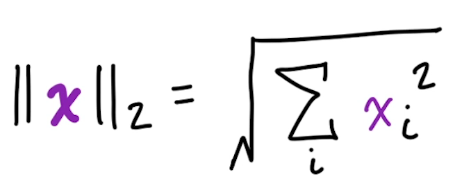
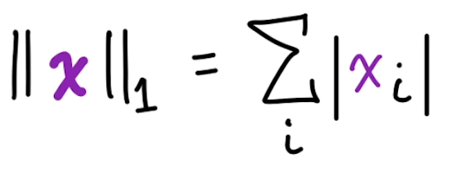
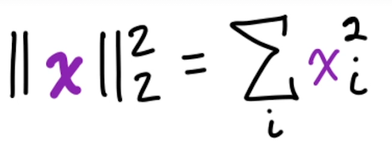
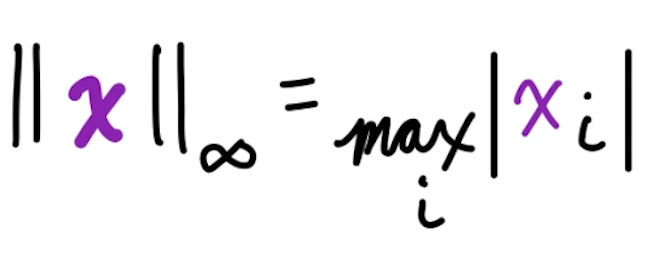
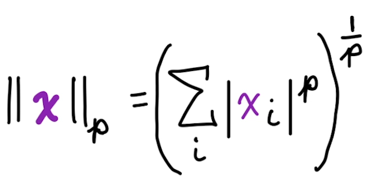

# 1. 선형대수학이란?

## 선형대수학이란?

선형 구조로 된 미지수가 있는 수학

즉 지수형태가 아니라 1차 식으로 되어 있다는 거지

**연립 1차 방적식으로 미지수를 푸는 수학**

### 대수학이란?

미지수가 있는 수학

### 선형대수학의 식의 종류 (이 세가지 경우 밖에 없어)

- 단 하나의 해
- 무한한 해
- 해가 없음.

### 머신러닝과의 관계

여러 변수로 구성된 하나의 식이야


분명 y 값도 엄청 다양하게 나올거야. 

그래서 결국 머신러닝은 이런 식들의 가중치를 맞춰서 y 값을 예측하는 거지.


# 5. 텐서

### 정의

차원에 상관없이 머신러닝을 위해 일반화된 벡터나 행렬

0D(scalar), 1D(vector), 2D(matrix), 3D~ (tensor) 를 모두 포함함.

## 6. Scarlar

- 0차원
- 숫자
- 보통 이텔릭체로 씀
- 보통 int, float32 타입으로 되어있음


파이토치로 스칼라를 만드는 법

* 파이토치로 하는 이유는 GPU를 쓰기 좋아.

```python
import torch

x_pt = torch.tensor(25)
x_pt.shape # torch.Size([])
```

## 7. 벡터

- 1차원 수의 배열
- 이탈릭 볼드체로  보통 써있어.
- 순서를 가지고 있고 인덱스를 가지고 있어.
- 다차원 그래프의 한 지점을 나타내

### Transposition 전치

- 보통 T 로 표현이 돼
- 행과 열을 바꿔누는 것.

```python
import numpy as np

x = np.array([25,2,5])
print(x.shape) #(3,)

x_t = x.T # x_t == x
print(x_t.shape) # (3,)

y = np.array([[25,2,5]])
print(y.shape) # (1,3)

y_t = y.T
print(y_t.shape) # (3,1)
```

```python
import torch

x_pt = torch.tensor([25,2,5])

```

## 8. Norm

노름은 벡터의 크기를 수량화 할 수 있는 클래스야

### L2 Norm



- 원점에서 벡터까지의 거리 (유클리드 거리)

```python
import numpy as np

x = np.array([25,2,5])
print(np.linalg.norm(x))
```

### unit vector

- 벡터의 길이가 1인 벡터
- L2 norm = 1

### L1 Norm



- 어디서 부터 재던지 선형성을 가져
- 0과 0이 아닌 것을 구분할 때 사용해

```python
import numpy as np

x = np.array([25,2,5])
np.abs(25) + np.abs(2) + np.abs(5)
```

### Squared L2



- x T x
- 계산하기가 매우 쉬워
- 그래서 머신러닝할 대 많이 쓰여
- 단 0 근처에서는 변화량이 크지 않아서, 0과 근접한 값을 구분할 때는 유용하지 않아

```python
import numpy as np

x = np.array([25,2,5])
np.dot(x,x)
```

### Max Norm  L∞



- 가장 큰 절대값을 나타냄


### Generalized Lp Norm



- p 의 조건
  - 실수
  - 1보다 크거나 같은 수
- p 의 값이 달라질 때마다 특징이 달라지지

### Basis Vectors 기저벡터

- 각 좌표계별로 크기가 1인 벡터
- 방향을 나타냄

### 직교벡터 Orthogonal

- 내적했을 때 0 이되는 벡터 (단, 크기가 0이 아닌)
- 즉 서로 각도가 90도를 이루는 벡터


