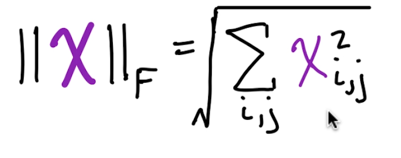
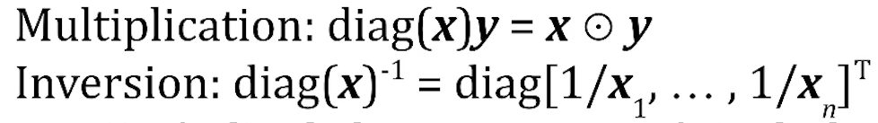

# 행렬의 성질

## Frobenius Norm



- L2 노름과 비슷하게, 다차원 행렬에서 거리를 의미할 수 있어

```python
import numpy as np
import torch
import tensorflow as tf

X = np.array([1,2],[3,4])
np.linalg.norm(X)
# torch, tf 에선 float 타입으로 넣어줘야 작동해. 
torch.norm(X)
tf.norm(X)


```

## 대칭 행렬

- 정사각 행렬
- X<sup>T</sup> = X

### Identity Matrice 단위행렬

- 대칭행렬
- 모든 대각 성분이 1
- 그 외의 값은 모두 0
- I<sub>n
- 다른 곱할 수 있는 행렬 X, XI = X

### 대각행렬 Diagnal Matrices

- 대각행렬을 제외한 모든 요소가 0
- 머신러닝 연산에서 유용하게 쓸 수 있어.

  - 단 0으로 나누면 안되겠지
- 정사각 행렬이 아닐 경우에도
  - 행이 많으면 0인 열을 추가하고
  - 열이 많으면 초과된 열을 삭제해서 정방형으로 만들 수 있어


## Matrix Inversion 역행렬

- 이것을 통해 선형대수학의 해를 구할 수 있어
  - 그러나 역행렬이 존재하지 않는 경우는 계산할 수 없는 한계가 있음
- X<sup>-1
- 역행렬과 원래 행렬을 행렬 곱하면 단위행렬이 나온다


```python
import numpy as np
import torch
import tensorflow as tf

# 역행렬을 구할 수 없을 때 작동하지 않음.
X=np.array([[4,2],[-5,-3]])
X_inv = np.linalg.inv(X)
torch.inverse(torch.tensor)
tf.linalg.inv(tf.Variable)
```

### 역행렬의 한계

- 평행한 선형식의 해를 구할 수 없어
- 과결정 연립방정식 (overdetermination) :: 행이 열보다 클 경우/ 차원의 수보다 방정식이 많을 경우 는 배제함
- 이런 경우도 해결할 순 있어, 이후 다룰 예정


## 직교행렬

- 일단 직교 벡터는 서로 수직을 이루고, norm 이 그 행렬의 크기를 가지는 경우
  - 정규직교벡터 (orthonormal vector) 란 직교 벡터면서 단위 벡터의 경우
- 모든 행과 열이 각각 서로의 정규 직교 벡터로 이루어져 있는 행렬
  - 0과 1로 이루어져 있고, 자신 행을 제외한 다른 벡터들이 전부 수직이므로
  - Q<sup>-1</sup> = Q<sup>T
  - 매우 쉽게 역행렬을 구할 수 있어.

  ### 이 부분이 어려워서 참고 유튜브
- [선대 필수 행렬](https://www.youtube.com/watch?v=XqOvyfMUAwA&pp=ygUM7KeB6rWQ7ZaJ66Cs)
- [직교 행렬 증명](https://www.youtube.com/watch?v=L2HAGXF1ek8&pp=ygUM7KeB6rWQ7ZaJ66Cs)
- [직교 행렬 성질 증명](https://www.youtube.com/watch?v=PkxYNFOuLIE)